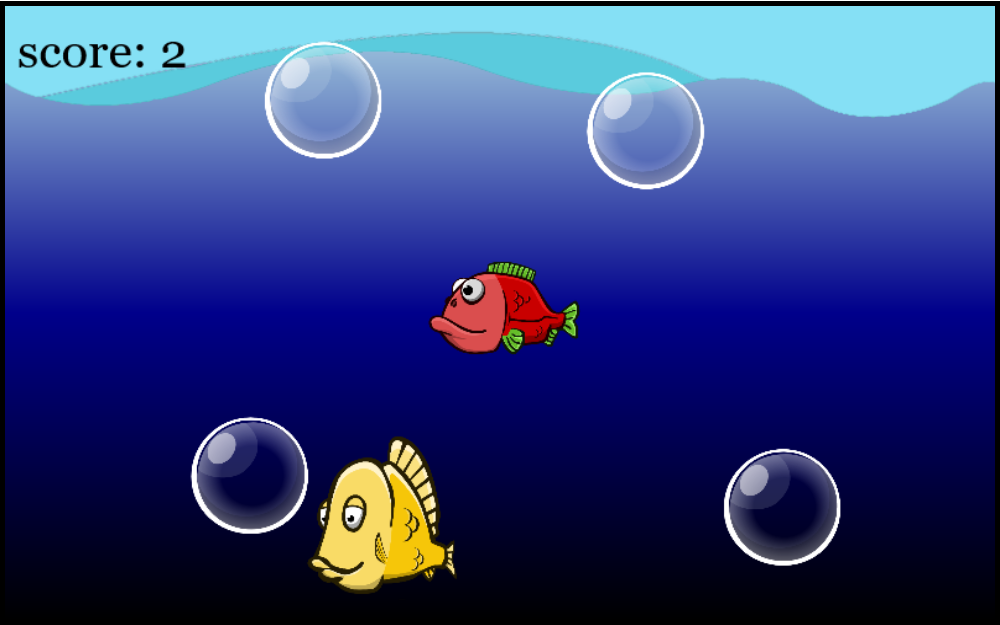

# Bubble Hunter (by tutorial)

## Description

### A game where your duty is to popping as many bubbles as you can avoiding other fishes. Some of them are pretty scary and dangerous.

### Be carefull this game can make you addicted! >:)

### Following by [Franks Laboratory](https://www.youtube.com/watch?v=jl29qI62XPg) js game tutorial  I wonder what can I achive and learn.

### On the first stages just playing with some js stuff from the tutorial then give some additional changes like:

- change sprite
- add leaderboard
- mobile usage support
- add restart button when the player lose

### Current issues:
- the two sound effect sometimes not playing when we pop two bubbles at the sime time or in just a few milliseconds difference